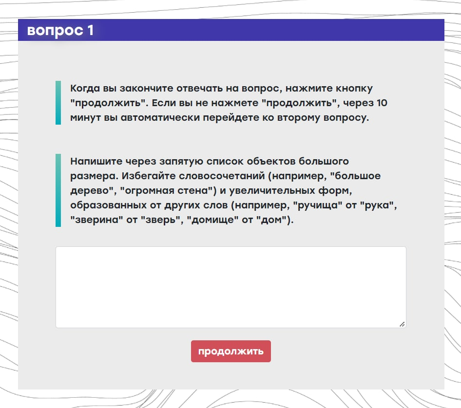

# Our own experiment:
[Here](https://docs.google.com/spreadsheets/d/1xBVP3IE8kJiCj-bOx1z7eSz4vJgYaz6-lTcJQDgy4O8/edit#gid=0) are lists of nouns for small and large that we collected and their production frequencies.
Below you may find the brief description of our experiment.
* 96 native Russian speakers
* every participant was given 10 minutes to compile a list of big objects
* then 10 minutes to compile a list of small objects (or vice versa)
* 288 concepts have been suggested as ‘big’ (39 more than five times) 
* 352 concepts have been suggested as ‘small’ (47  more than five times)
* we asked half of the participants to name entities that would have been known to XIXth century person as a means to prevent them from listing nouns for technological objects which are almost recent loanwords and are absent from the available lexical lists (самолет ‘plane’, микроб ‘microbe’)
* we asked participants not to use diminutives and multiword expressions (веточка, малюсенькая ветка ‘little branch’)
* This is how our query looked like:

