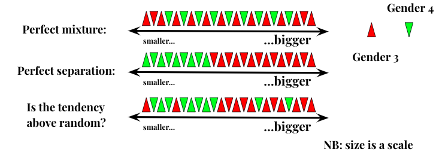

# CATEGORIAL SIZE EXPERIMENT

In this experiment we test for the __Categorial Size Hypothesis.__ It is formulated as follows: in Archi (also Lak, Tsakhur and Rutul) within specific conceptual categories, small objects go to Gender 4 and/or big objects go to Gender 3. Here we probe for semantic categories of BIRDS, ANIMALS, WILD ANIMALS, BODYPARTS, TOOLS. 

Overall procedure looks like this: we take Kibrik & Kodzasov «Imya» Thesaurus (1990?) and retrieve all the members of the respective semantic categories. Then we assign size values to the concepts within a given category: we try to find out how different members of BIRDS/TOLLS/etc. are related to each others size-wisely.
To do so we run our card-sorting experiment: we ask a participant to group together members of a given category on the grounds of their similarity in size. Cards for every semantic category are evaluated by 10 participants. Then we take the mean value for every concept and compile these mean values into the intra-categorial scale. At this point we have 5 scales of concepts aligned on the ground of their size scores (for 5 semantic categories). Then we translate concepts into 4 languages and retrieve gender values of every word in a given language. At this point we  have 4 databases of this kind:

ARCHI:
| concept | size value | word | gender value |
|---------|------------|------|--------------|

Next we run Mann-Whitney U test to check for above-random separation (mutual displacement) in the ordering of two samples (gender 3 nouns and gender 4 nouns) along a scale:

##These are the p-values that we got:

_ARCHI_
BIRDS: gender 3 is bigger, p-value: 0.005622733175078314 
BODYPARTS: there is no significant difference, p-value: 0.8277382910534468 
TOOLS: gender 4 is bigger, p-value: 0.006927526368356346 
ANIMALS: gender 3 is bigger, p-value: 0.018023701756087862 
WILD ANIMALS: there is no significant difference, p-value: 0.05976215381948469

_LAK_ (all ANIMALS and BIRDS go gender 3)
BODYPARTS: there is no significant difference, p-value: 0.1831870613765758 
TOOLS: there is no significant difference, p-value: 0.4644182618953264 

_RUTUL_ (all ANIMALS and BIRDS go gender 3)
BODYPARTS: there is no significant difference, p-value: 0.15060528553926286 
TOOLS: there is no significant difference, p-value: 0.10516742324521319 

_TSAKHUR_ (all BIRDS are gender 3)
WILD ANIMALS: there is no significant difference, p-value: 0.8736424410187432 
ANIMALS: there is no significant difference, p-value: 0.13939509407377476 
TOOLS: there is no significant difference, p-value: 0.7320931128468913 
BODYPARTS: there  is no significant difference, p-value: 0.05976215381948469

##In this folder you may find:

1. sets of concepts that we used: [animals](https://duckduckgo.com), [wild animals](https://duckduckgo.com), [birds](https://duckduckgo.com), [tools](https://duckduckgo.com), [bodyparts](https://duckduckgo.com)
2. aggregated ranks for concepts within categories: [animals](), [birds](), [tools](), [bodyparts]()
3. all the produced rankings before the aggregation: [animals rankings](), [birds rankings](), [tools rankings](), [bodyparts rankings]()
