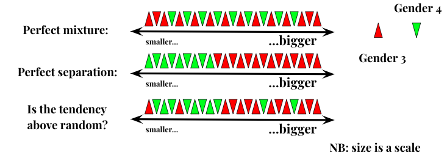

{\rtf1\ansi\ansicpg1251\cocoartf2580
\cocoatextscaling0\cocoaplatform0{\fonttbl\f0\fnil\fcharset0 Menlo-Regular;\f1\fswiss\fcharset0 Helvetica;\f2\froman\fcharset0 Times-Roman;
}
{\colortbl;\red255\green255\blue255;\red0\green0\blue0;}
{\*\expandedcolortbl;;\cssrgb\c0\c0\c0;}
\paperw11900\paperh16840\margl1440\margr1440\vieww12700\viewh5240\viewkind0
\pard\tx566\tx1133\tx1700\tx2267\tx2834\tx3401\tx3968\tx4535\tx5102\tx5669\tx6236\tx6803\pardirnatural\partightenfactor0

\f0\fs24 \cf0 # CATEGORIAL SIZE EXPERIMENT
\f1 \

\f0 \
In this experiment we test for the Categorial Size Hypothesis. It is formulated as follows: in Archi (also Lak, Tsakhur and Rutul) \cf2 \expnd0\expndtw0\kerning0
\outl0\strokewidth0 \strokec2 within specific conceptual categories, small objects go to Gender 4 and/or big objects go to Gender 3. Here we probe for semantic categories of BIRDS, ANIMALS, WILD ANIMALS, BODYPARTS, TOOLS. \
\
Overall procedure looks like this: we take Kibrik & Kodzasov \'abImya\'bb Thesaurus (1990?) and retrieve all the members of the respective semantic categories. Then we assign size values to the members within a given category: we try to find out how different members of BIRDS/TOLLS/etc. are related to each others size-wisely.\
To do so we run our card-sorting experiment: we ask a participant to group together members of a given category on the grounds of their similarity in size. Cards for every semantic category are evaluated by 10 participants. Then we take the mean value for every member (okay this is way too simplistic) and compile them into the intra-categorial scale. At this point we have 5 scales of concepts aligned with their size scores (for 5 semantic categories). Then we translate concepts into 4 languages and retrieve gender values of every word in a given language. At this point we  have 4 databases of this kind:\
\
ARCHI:\
| concept | size value | word | gender value |\
|---------|------------|------|--------------|\
\
Next we run Mann-Whitney U test to check for above-random separation (mutual displacement) in the ordering of two samples (gender 3 nouns and gender 4 nouns) along a scale:\
\
\pard\pardeftab720\partightenfactor0
\cf2 \
\
These are the p-values that we got:\
_ARCHI_\
\
_LAK_\
_RUTUL_\
_TSAKHUR_\
 
\f2 \
\pard\tx566\tx1133\tx1700\tx2267\tx2834\tx3401\tx3968\tx4535\tx5102\tx5669\tx6236\tx6803\pardirnatural\partightenfactor0
\cf2 \

\f0 \
\
In this folder you may find:\
\
1. }